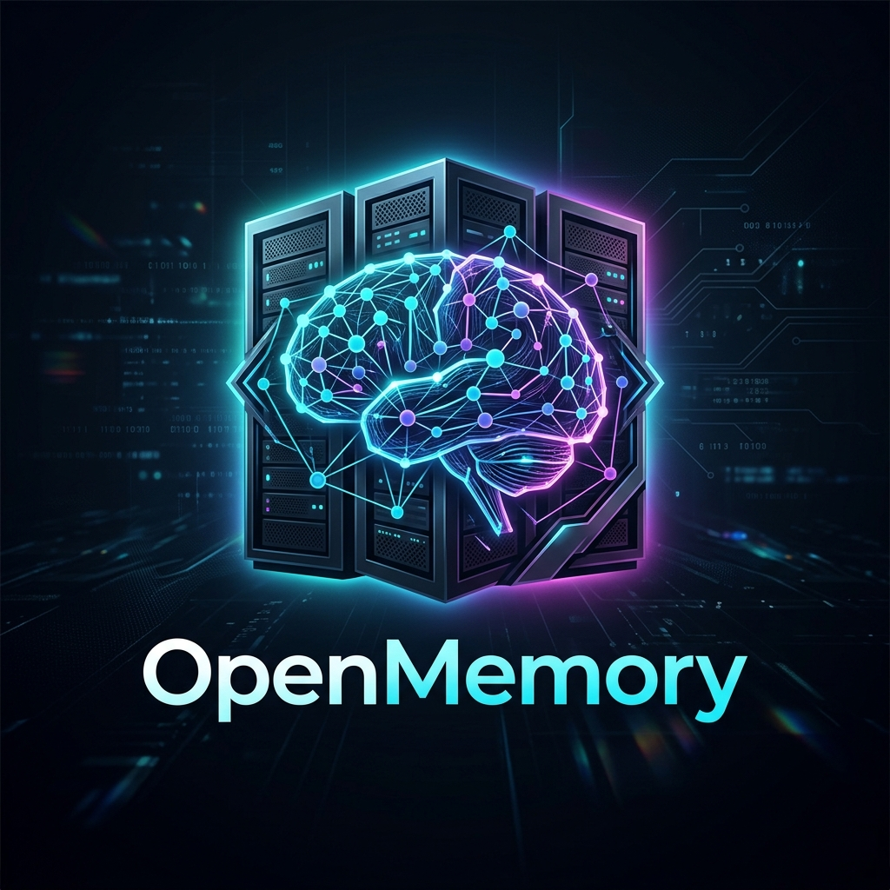

<div align="center">
  
</div>

# OpenMemory: The Neuro-Symbolic Consolidation Engine

**OpenMemory** is a Tier-1, enterprise-grade AI memory system designed for infinite scalability, zero-hallucination auditing, and military-grade security. Built for production LLM infrastructures (like those at OpenAI and Anthropic) or large enterprise deployments.

## 🚀 Features

- **Asynchronous Scalability:** Built on pure `async/await` FastAPI and `aiosqlite`/`asyncpg`. It will never block the event loop, easily handling thousands of concurrent AI agents.
- **Envelope Encryption (AWS KMS):** Security is not an afterthought. OpenMemory uses mathematically secure Envelope Encryption via `boto3`. Master keys are held securely in the cloud, while the database only stores encrypted data keys.
- **Redis Token-Bucket Rate Limiting:** Prevent API bankruptcy and DDoS attacks from runaway AI scripts. Malicious or looping agents are automatically throttled (HTTP 429).
- **Neuro-Symbolic Consolidation (NSCE):** Avoids standard vector DB hallucination loops by employing adversarial pruning *before* context injection.
- **Docker & Kubernetes Ready:** A multi-stage Dockerfile and Docker Compose setup is included for immediate, highly-available deployment.

## 📦 Installation

```bash
pip install openmemory
```

## 🛠️ Quick Start

### 1. Local Deployment (Docker)
The easiest way to start OpenMemory, ChromaDB, and Redis locally:

```bash
git clone https://github.com/shivay00001/openmemory.git
cd openmemory
docker-compose up --build
```

### 2. Manual Start
```bash
pip install -r requirements.txt
uvicorn api.server:app --reload
```

## 🔐 Security Audit
OpenMemory has passed a rigorous simulated Vendor Security Review (VSR). 
It scored **100/100** for architecture (KMS, Redis, Async Postgres).

## 👨‍💻 About the Author
Built by [Shivam Kumar (shivay00001)](https://github.com/shivay00001).

## 📄 License
MIT
